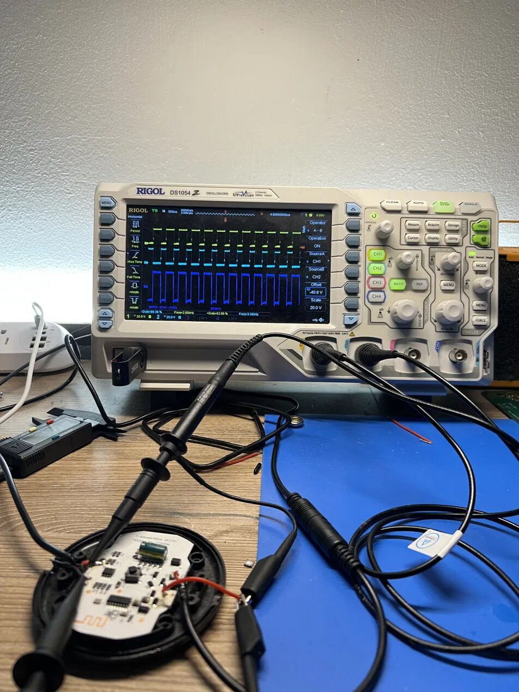
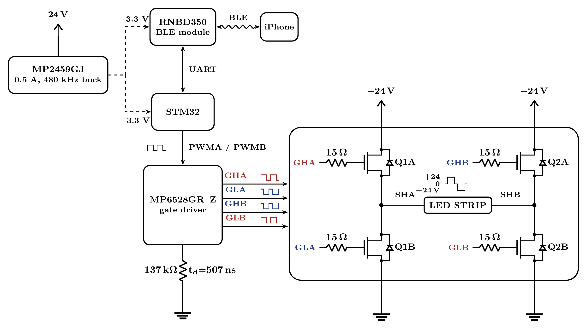

<p align="center">
  
</p>

<h1 align="center">LED Shelf Controller</h1>

<p align="center">
The stock controller on my LED shelf whined, and it got louder as I dimmed it.<br>
This is how I worked out why, and the silent replacement I built to fix it:<br>
a 25&nbsp;kHz H-bridge driver with BLE control from my phone, on a custom 4-layer board.
</p>

---

## The Problem

The shelf is a 24 V tunable-white LED strip driven by an off-the-shelf controller. At full brightness it puts out a faint high-pitched whine. Dim it to a normal, usable level and the whine gets worse, turning into a piercing tone that's hard to ignore once you've heard it.

<!-- TODO: embed hiss demo clip here (drag-drop .mp4 into web editor, <10MB, caption "🔊 sound on") -->

<p align="center">
  
</p>

So I opened it up and put it on the bench.

## Reverse Engineering the Original

<p align="center">
  
</p>

Probing the two output lines (SHA and SHB) showed how it works. The controller takes 24 V in from the brick, but it drives the strip differentially: the two lines swap polarity, so the strip sees either +24 V or -24 V across it. The strip has two anti-parallel LED strings, so one polarity lights the warm (orange) LEDs and the other lights the cool white ones.

| Mode | Capture |
|---|---|
| Fully warm, output dwells on one polarity |  |
| Fully cool, output dwells on the opposite polarity |  |
| Mixed colour (50/50), low brightness, 0 V dwell between polarity flips |  |

These are all differential (SHA-SHB) measurements. The warm and cool captures are at around 75 % brightness; the mixed one is at low brightness, which makes the 0 V dwell easy to see.

Colour comes from the ratio of time spent at +24 V versus -24 V. Brightness comes from inserting 0 V dwell into the waveform: the more zero time, the dimmer the strip.

### Why it whines

The switching fundamental sits at 2 kHz, right in the audible range where our hearing is most sensitive. Here is the differential measurement at max brightness in 50/50 colour mode with an FFT underneath: the fundamental plus a comb of harmonics running up through the audible band.

<p align="center">
  
</p>

The dimming behaviour makes sense in the frequency domain too. Adding 0 V dwell for brightness control breaks the symmetry of the waveform, and that pushes energy into extra harmonics. At low brightness the 4th, 8th, and 12th harmonics grow noticeably:

<p align="center">
  
</p>

So there is more audible harmonic energy at exactly the brightness you'd actually run the shelf at. That is the whine. The magnetics and ceramic caps on the board turn that electrical spectrum into an acoustic one.

The fix follows directly: keep the same drive scheme, but move the fundamental above the range human ears can hear.

## The Replacement Design

A full bridge (H-bridge) is the natural way to recreate the ±24 V / 0 V drive. It's the same topology used in motor drives. It switches the strip between +24 V and the reversed polarity, and it can hold the strip at 0 V on its own. I run the PWM fundamental at 25 kHz, which puts it and every harmonic above it out of the audible band.

<p align="center">
  
</p>

Everything runs off the 24 V brick. An MP2459 buck makes the 3.3 V rail for the STM32 and the BLE module. The phone talks to the RNBD350 over BLE, and the RNBD350 forwards commands to the STM32 over UART. The STM32's two PWM outputs feed an MP6528 gate driver, which switches the four FETs of the bridge through 15 Ω gate resistors. A 137 kΩ resistor on the driver's DT pin sets 507 ns of dead time between the high and low FET of each leg, so a leg can never shoot through during a transition (this pin shows up again in the failure section). The strip sits between the two switch nodes, SHA and SHB.

| Function | Part | Notes |
|---|---|---|
| Gate driver | **MP6528GR-Z** | 5-60 V H-bridge gate driver for four N-channel FETs. Bootstrap high-side supply with internal charge pump for 100 % duty operation, adjustable dead-time via DT pin, OCP, UVLO. QFN-28 with exposed pad. |
| Power stage | **SQJ746ELP** ×2 | Vishay dual N-channel 40 V TrenchFET, 8.8 mΩ, PowerPAK SO-8L. Two dual packages make up the full bridge. AEC-Q101 automotive-qualified. |
| MCU | **STM32F303K8T6** | Cortex-M4F at 72 MHz. Advanced-control timer with complementary outputs and hardware dead-time insertion generates the bridge PWM. |
| BLE | **RNBD350PE-I/100** | Microchip Bluetooth LE 5.2 certified module. Talks to the STM32 over UART; the iOS app sends colour and brightness, and the MCU maps them to timer compare (CCR) values. |
| Logic rail | **MP2459GJ-Z** | 55 V-input, 0.5 A, 480 kHz buck stepping the 24 V brick down to the logic rail. |

### The PWM generation problem

The strip needs three levels in each period: +24 V for one colour, then -24 V for the other, then 0 V for the rest of the period to set brightness. A normal complementary PWM pair only gives two states, so the waveform is synthesized from three timer channels.

<p align="center">
  
</p>

The timebase is straightforward. APB1 runs at 64 MHz, the prescaler divides by 64, and ARR is 39, so the counter rolls over every 40 counts. That gives a 25 kHz period made of 40 slots of 1 µs each, and the compare registers pick which slot each edge lands on. Duty resolves in steps of 1/40, so brightness and colour adjust in 2.5 % increments.

Two user settings map onto two compare values. Brightness is y, the number of conducting slots out of 40. Everything past y is off time, both bridge legs idle and 0 V across the strip, so 40 - y slots of dead output is what dimming actually is. Colour is a ratio from 0 to 1 that splits the conducting window between the two sides: x = y × colour. TIM A is high from slot 0 to x and drives the +24 V side. TIM B is not a physical output at all, it exists purely as internal comparison logic with its compare set at y. TIM C produces the -24 V side using combined PWM mode 2, which yields NOT(A) · B rather than a plain AND, exactly the term needed: high only from x to y.

Sliding the colour ratio stretches one side of the window at the expense of the other, and lowering y squeezes both together while growing the 0 V tail.

<!-- TODO: link the timer configuration source file here once the firmware project is committed -->


## Build and Bring-up (Version 1)

<p align="center">
  
</p>

I hand-assembled Version 1, QFN gate driver and all, and brought it up on the bench. It worked: clean PWM on the bridge, and the strip ran silently at 25 kHz.

<p align="center">
  
</p>

## What Went Wrong Along the Way

**A hidden open joint under the QFN.** The board powered up, but the bridge output was distorted in a way that looked like half a dozen different faults at once. The real cause was the MP6528's DT (dead-time) pin, which wasn't making contact with its programming resistor. One bad joint under the QFN from an uneven hot-air reflow. Finding it took much longer than fixing it. Reflowing on a hot plate gave reliable joints and the distortion went away.

<p align="center">
  
</p>

**A trace too close to a FET pad.** V1 ran a thin trace right up against an inner MOSFET pad, which caused solder bridges during assembly. I ended up chasing those down under the microscope.

<p align="center">
  
</p>

**Probing a live switch node killed the driver.** While I was capturing SHA/SHB waveforms on the working V1 board, the gate driver died, almost certainly from a momentary probe or ground-clip short on a live switch node. The rework to replace it bridged, and pulling the dead part lifted the QFN pads with it. What I took from it: use spring-tip probe grounds, current-limit the first power-up, and leave the risky measurements for last, once the photos are already taken.

## Version 1.1

V1.1 (the black ENIG board at the top) folds those lessons in: fixed clearances around the FET pads, a general layout cleanup, and the full Shady Electronics treatment with a 4-layer stackup, a via-stitched perimeter, and a custom octagonal outline.

<!-- TODO: assembled v1.1 photos when boards arrive -->
<!-- TODO: v1.1 output FFT at 25kHz + stacked comparison vs original 2kHz FFT with audible band shaded -->
<!-- TODO: BLE demo gif/clip -->

## Status

- [x] Original controller reverse-engineered, noise mechanism identified
- [x] V1 designed, assembled, verified silent at 25 kHz
- [x] V1.1 layout revisions, fabbed
- [ ] V1.1 assembly and bring-up
- [ ] Before/after acoustic and FFT comparison
- [ ] Full video writeup

## Repo Layout

```
hardware/   schematics, layout notes, BOM
firmware/   STM32 project (timer scheme, BLE UART protocol)
media/      scope captures, photos, diagrams
```
