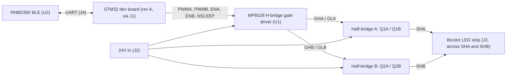

# System architecture (rev A)

> Scope: this document describes how the LED shelf controller is organized as a system: the power path, the control interface to the MCU, the gate driver and power stage, the LED output, and the wireless module. The motivation (replacing a noisy stock controller) lives in [`00_overview.md`](00_overview.md); measured behavior lives in [`03_results.md`](03_results.md).

## Hardware revisions

This is the part that drives every decision below.

| Rev | MCU | Status |
|-----|-----|--------|
| A | External STM32 dev board, socketed into headers `J1` and `J4` | Current, built |
| B | STM32 integrated directly onto the board | Planned |

The control interface was deliberately drawn as a connector boundary (`J1`, `J4`) so the same circuit can be prototyped with a dev module now and respun with the MCU on board later. Because the signals crossing that boundary (`PWMA`, `PWMB`, `ENA`, `ENB`, `NSLEEP`, plus the BLE UART) keep the same meaning across both revs, **the firmware is intended to run unchanged from rev A to rev B**. The only thing that changes is where those signals physically originate.

## Topology in one line

A single full H-bridge (MP6528 gate driver plus four external N-channel MOSFETs) drives a two-wire bicolor LED strip as its load, the same way the driver would drive a DC brush motor. Current direction sets the color, PWM duty sets the brightness.

## Block diagram

## Functional blocks

### Power input
24V enters on screw terminal `J2` (`24V+`, `GND`), with bulk decoupling on the rail (`C7` 100 µF, `C6` 100 nF). The 24V rail supplies both the gate driver and the high sides of the power stage. The BLE module runs from a separate 3.3V supply. *(Confirm where the 3.3V rail is generated: on board, from the dev board, or external.)*

### Control interface (J1), the MCU boundary
`J1` is the 6-pin header the STM32 dev board plugs into in rev A. It carries the full control set for the driver:

| J1 pin | Net | Direction (MCU view) | Function |
|--------|-----|----------------------|----------|
| 1 | `NSLEEP` | out | Wake / sleep the gate driver (active low sleep) |
| 2 | `ENA` | out | Enable phase A |
| 3 | `ENB` | out | Enable phase B |
| 4 | `PWMA` | out (timer) | PWM, phase A (drives `SHA` toward `VIN` when high) |
| 5 | `PWMB` | out (timer) | PWM, phase B (drives `SHB` toward `VIN` when high) |
| 6 | `GND` | — | Common ground |

> Note: board silk lists these in reverse order (`GND`, `PWMB`, `PWMA`, `ENB`, `ENA`, `SLEEP`). Check orientation against the silk before plugging in.
>
> `nFAULT` is available at the driver but is **not** broken out to `J1` in rev A. *(Confirm whether you want fault reporting routed to the MCU in rev B.)*

STM32 pin / timer assignment *(fill from your dev board wiring)*:

| Net | STM32 pin | Peripheral |
|-----|-----------|------------|
| `PWMA` | TODO | TIMx_CHy |
| `PWMB` | TODO | TIMx_CHz |
| `ENA` | TODO | GPIO |
| `ENB` | TODO | GPIO |
| `NSLEEP` | TODO | GPIO |
| BLE TX/RX | TODO | USARTx |

### Gate driver (U1, MP6528)
U1 is a Monolithic Power Systems **MP6528**, a 5V to 60V H-bridge gate driver in a QFN-28. It takes the `PWMx` / `ENx` logic, generates high-side and low-side gate drive for both phases, and provides protection. Relevant behavior and support circuitry:

- Gate drive supply is an internal charge pump producing `VREG` of roughly 11.5V, running at about 110 kHz (above the audible band, so the driver itself adds no audible tone). Flying cap on `CPA`/`CPB` is `C2` (470 nF), `VREG` bypass is `C1` (10 µF).
- High-side drive uses a bootstrap cap per phase plus an internal trickle charge pump that keeps the bootstrap topped up, so **100% duty is supported**. Bootstraps are `C3` (470 nF, `BSTA`/`SHA`) and `C4` (470 nF, `BSTB`/`SHB`).
- Dead-time is set by a single resistor on `DT` to ground, per `tDEAD(ns) = 3.7 * R(kΩ)`. *(Confirm the fitted `RDT` value and the resulting dead time.)*
- Short-circuit protection senses MOSFET VDS against the `OCREF` voltage, set here by `R1` (1.37 kΩ) and `R2` (1.00 kΩ). *(Confirm the divider source node and the resulting VDS trip threshold; the part expects `OCREF` between 0.125V and 2.4V.)*
- Overcurrent protection trips at 500 mV across the low-side shunt on `LSS`. *(Confirm whether an `LSS` shunt is fitted and its value, or whether `LSS` is tied to ground to disable OCP.)*
- `NSLEEP` wakes the part (about 1 ms wake-up); `nFAULT` is an open-drain fault flag.

### Power stage (one H-bridge)
Four N-channel MOSFETs, in two dual-NMOS packages (`Q1`, `Q2`), form the two half-bridges of a single full H-bridge:

| Half-bridge | High-side | Low-side | Gate resistors | Output node |
|-------------|-----------|----------|----------------|-------------|
| A | Q1A | Q1B | `R3`, `R4` (10 Ω) | `SHA` |
| B | Q2A | Q2B | `R5`, `R6` (10 Ω) | `SHB` |

High sides tie to the 24V rail (`VIN`); low sides return through `LSS`, which also serves as the OCP current-sense node. The strip is connected **between** `SHA` and `SHB`, so the two half-bridges work together as one bridge rather than as independent channels.

### LED output (J3) and color control
Screw terminal `J3` brings out the two bridge outputs, and the bicolor strip connects across them (not to ground):

| J3 pin | Net | Board label | Positive when... |
|--------|-----|-------------|------------------|
| 1 | `SHA` | `MAGENTA+` | magenta is lit |
| 2 | `SHB` | `YELLOW+` | yellow is lit |

The strip behaves like a load with two antiparallel LED sets. Driving current `SHA -> SHB` (phase A high, phase B low) lights magenta; reversing it (`SHB -> SHA`) lights yellow. PWM duty on the high-side phase sets brightness; the enables (`ENA`/`ENB`) gate each phase. *(Confirm the exact firmware drive scheme, e.g. sign-magnitude with one phase PWMed while the other is held low.)*

### Wireless (BLE, U2)
U2 is a Microchip RNBD350 (`RNBD350PE-I100`) BLE module on its own schematic sheet, running from 3.3V (decoupling `C5`/`CB`, `C9`/`C10`). It connects to the MCU over UART, broken out at `J4`:

| J4 pin | Net | Board label |
|--------|-----|-------------|
| 1 | `3.3V` | `3.3V` |
| 2 | `RESET` (NMCLR) | `RESET` |
| 3 | `BLE_RX` | `STM_TX` |
| 4 | `BLE_TX` | `STM_RX` |
| 5 | `GND` | `GND` |

UART is crossed over (`BLE_RX` to `STM_TX`, `BLE_TX` to `STM_RX`). The module is populated on the rev A board; firmware-side BLE control is tracked as a roadmap item. *(Confirm current firmware BLE status.)*

## Noise-reduction design notes

This is the design intent that separates this controller from the stock part it replaces:

1. **PWM above the audible band.** The stock controller PWMs at 2 kHz, squarely in the audible range, which is the source of the whine. This design runs PWM at *(TODO: state your frequency, e.g. ~25 kHz)*, above the audible band.
2. **Controlled switching edges.** The MP6528 plus series gate resistors and a set dead time shape the switching edges. The datasheet recommends 10 Ω to 100 Ω series gate resistance to slow edges for EMI and noise control; the board fits 10 Ω (`R3`-`R6`), at the fast end of that range, so increasing them is an available knob if residual switching noise needs to come down further (at the cost of switching loss).
3. **Dynamic max-duty cap.** The driver itself supports 100% duty, so capping maximum duty is a deliberate choice in firmware to limit worst-case current draw and ripple into the SMPS, reducing supply hiss. *(Confirm the cap value and the condition that triggers it.)*

## Open items to confirm

- [x] Gate driver U1 part number: MP6528 (MPS)
- [x] Strip topology: bicolor strip driven differentially across the H-bridge, color set by current direction
- [ ] Operating PWM frequency
- [ ] Max-duty cap value and trigger condition
- [ ] `RDT` value on `DT` and resulting dead time
- [ ] `OCREF` divider source node and resulting VDS trip threshold
- [ ] Whether an `LSS` shunt is fitted (OCP) and its value
- [ ] Firmware drive scheme for color/brightness (sign-magnitude vs other)
- [ ] Where the 3.3V rail is generated
- [ ] STM32 pin / timer / USART assignments (table above)
- [ ] Whether `nFAULT` should be routed to the MCU in rev B
