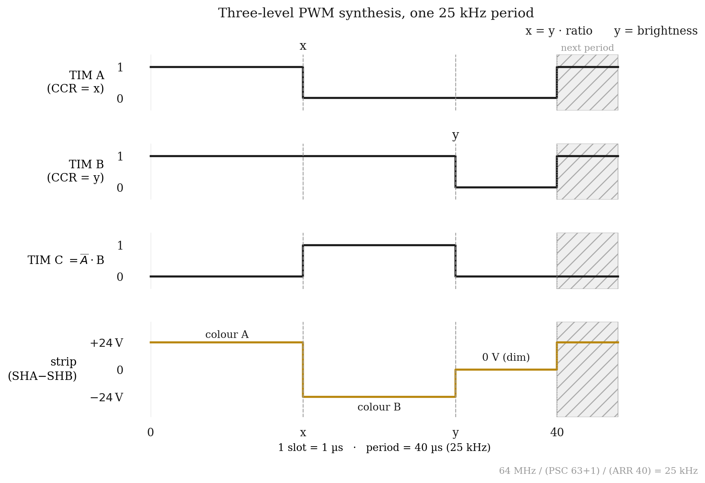

# Firmware

STM32F303K8 firmware for the LED shelf controller.

## Three-timer PWM synthesis

The strip needs a three-level differential waveform (+24 V / 0 V / -24 V) where the polarity ratio sets colour and the 0 V dwell sets brightness. A complementary PWM pair only gives two states, so the output is built from three timer channels: TIM A drives one side of the bridge, TIM B exists only as internal compare logic marking the end of the conducting window, and TIM C uses combined PWM mode 2 to produce NOT(A) · B for the other side.

  

Timebase: APB1 at 64 MHz, prescaler /64, ARR 39. The counter rolls over every 40 counts, giving a 25 kHz period of 40 slots at 1 µs each. Brightness and colour resolve in 2.5 % steps. The full walkthrough is in the root README's "PWM generation problem" section.

<!-- TODO: link the timer configuration source file here once the project is committed -->

## Control path

BLE (RNBD350) to UART to firmware. The app sends colour and brightness, and the MCU maps them to timer compare (CCR) values.

<!-- TODO: document the BLE UART command format (byte layout for colour/brightness) once the protocol is finalised in source -->

## What lands here

- STM32CubeIDE project
- Timer configuration for the three-level waveform synthesis
