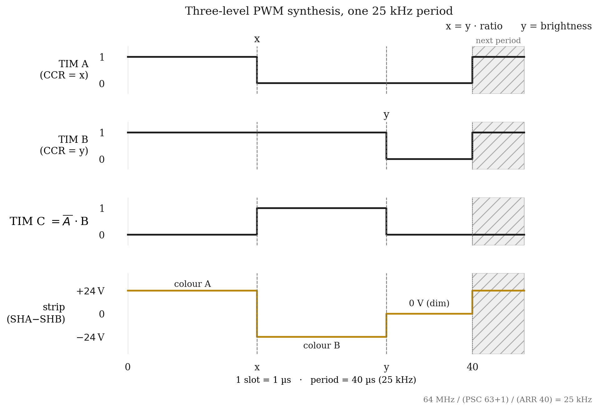

# Firmware

STM32F303K8 firmware for the LED shelf controller. The interesting parts all live in
[`main.c`](main.c): the PWM synthesis, the BLE UART protocol and settings persistence.

## Three level PWM on one timer

The strip needs a three level differential waveform (+24 V / 0 V / -24 V) where the
polarity ratio sets colour and the 0 V dwell sets brightness. A complementary PWM pair
only gives two states, so the output is built from three channels of TIM1:

- CH3 drives the +24 V side, high from slot 0 to x
- CH2 never leaves the chip, it just marks the end of the conducting window at y
- CH1 runs combined PWM mode 2, which gates its own compare against CH2 so it comes out
  high only from x to y, the -24 V side

  

Timebase: 64 MHz clock, prescaler 63, ARR 39. The counter rolls over every 40 counts,
giving a 25 kHz period of 40 slots at 1 µs each. Brightness and colour resolve in 2.5 %
steps. The full walkthrough is in the root README's "PWM generation problem" section.

The main loop also refuses to output pulses narrower than 5 slots, they just get rounded
down to 0 V. Runt pulses through a power bridge aren't worth 12.5 % of one brightness step.

## BLE UART protocol

The RNBD350 talks to USART1 at 115200. Every frame is 4 bytes:

| Byte | Meaning |
|---|---|
| `0xC8` | start byte |
| 0 to 40 | brightness, conducting slots out of 40 |
| 0 to 40 | colour, scaled to the 0 to 1 ratio |
| `0xFA` | end byte |

The receive interrupt hunts for the start byte one byte at a time, then reads the rest of
the frame. A payload of `0xFB 0xFB` is a state request: the app sends it on connect and
the board answers in the same frame format, so the sliders in the app always match what
the strip is actually doing.

## Remembering settings

The F303 has no EEPROM, so one flash page stands in for it. Brightness and colour get
packed into a halfword and written 1.5 s after the last change, which keeps slider
dragging from hammering the erase cycles. On boot the page is read back and the strip
comes up exactly how you left it.

## Bring up order

PWM starts first, then the gate driver enable pins go high a few tens of ms later, so the
bridge never switches on undefined gate signals.

<!-- TODO: rest of the CubeIDE project (ioc, linker script) if anyone wants to build it -->
