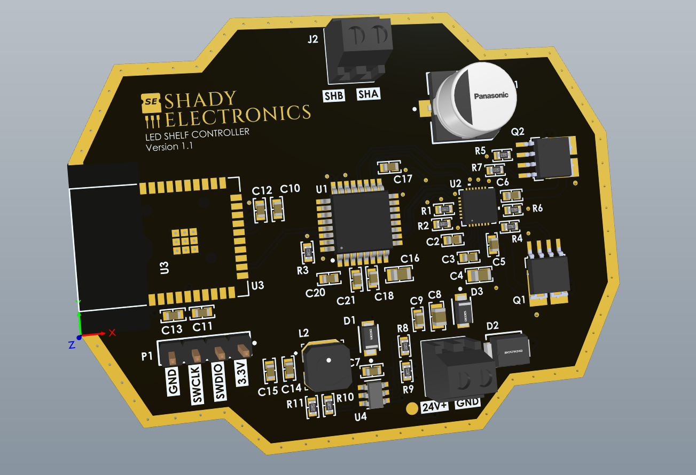
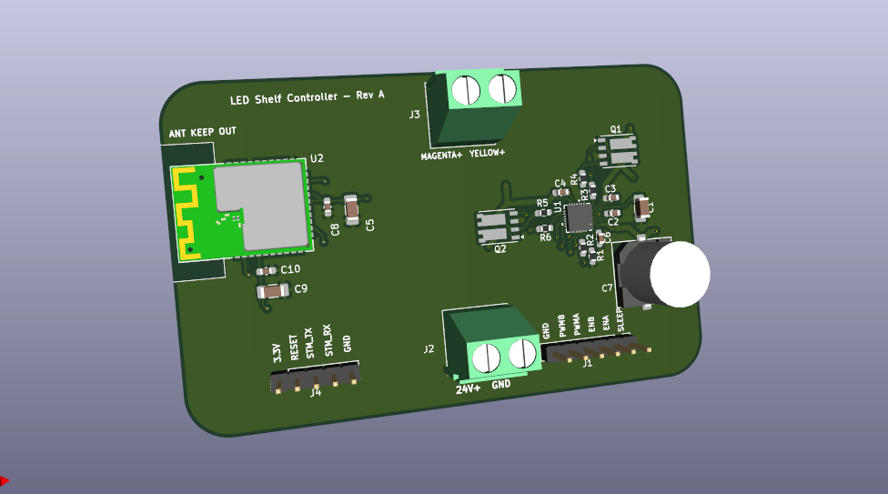

# Hardware

Board design for the quiet 24 V tunable white LED shelf controller.

**V1.1 is the current revision.** It's assembled, brought up, and running the shelf. V1 was
assembled and working before it was retired (see the failure section of the
[root README](../README.md)).

## Files

| File | What it is |
|---|---|
| [`schematic_v1_1.pdf`](schematic_v1_1.pdf) | V1.1 schematic, drawn in Altium |
| [`schematic_v1.pdf`](schematic_v1.pdf) | V1 schematic, drawn in KiCad |
| [`BOM_v1_1.csv`](BOM_v1_1.csv) | V1.1 bill of materials |

## Renders

<table>
  <tr>
    <th width="50%">V1.1</th>
    <th width="50%">V1</th>
  </tr>
  <tr>
    <td></td>
    <td></td>
  </tr>
</table>

V1.1 moved to a 4 layer stackup, designed in Altium with a via stitched perimeter and a custom octagonal
outline that fits the original controller's round enclosure. V1 was a simpler rectangular
board made in KiCad.

## Core parts

| Function | Part |
|---|---|
| MCU | STM32F303K8T6 |
| Gate driver | MP6528 |
| Power FETs | 2× SQJ746ELP (dual N channel) |
| BLE module | RNBD350 |
| Logic rail | MP2459 |

The strip is driven as a three level differential waveform (+24 V / 0 V / -24 V) at 25 kHz,
so the fundamental and its harmonics sit above the audible band.
